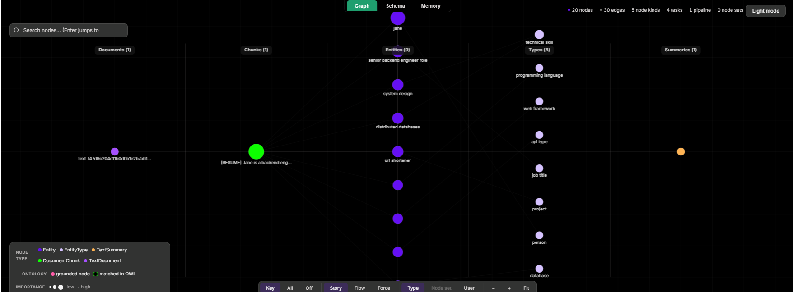

# 🎯 Interview Memory Coach

**AI interview coaching that remembers *your* history — not generic advice.**

Most AI interview prep starts from zero every time. You paste your resume, it gives you the same tips it gives everyone, and it forgets you the moment the session ends. Interview Memory Coach is different: it builds a **permanent, structured memory** of your resume, your target role, and every past interview where you struggled — then coaches you against *your actual gaps*.

> Your interview history → a knowledge graph → grounded coaching that names your real weaknesses → an offer you actually land.

Built on [Cognee](https://github.com/topoteretes/cognee)'s self-hosted, hybrid graph-vector memory layer for **The Hangover Part AI: Where's My Context?** hackathon.

---

## Why this isn't just RAG

A normal RAG chatbot retrieves text chunks and hopes the LLM stitches them together. Interview Memory Coach uses Cognee's **`GRAPH_COMPLETION`** search — it traverses a real knowledge graph extracted from your history, so the coaching is grounded in *connected facts*, not loose snippets.

Ask it "How should I prepare for system design?" and it doesn't give textbook advice. It answers:

> *"You've struggled with system design in past interviews — you were asked to design a URL shortener at 10M req/day, proposed SQLite, and admitted you couldn't handle distributed scale. The senior backend role you're targeting requires exactly this..."*

That specificity comes from the graph below — where `jane → senior backend engineer role → system design → distributed databases → url shortener` are real nodes connected by real relationships.



*The memory graph: Cognee parsed a resume, job description, and past interview Q&A into 20 entity nodes and 30 relationships, stored in an embedded graph database. Every coaching answer traverses this graph.*

**▶️ [Watch the 3-minute demo](https://youtu.be/Qv29MZECxZ8)**

---

## The full Cognee memory lifecycle

This project uses **all four** of Cognee's memory operations — each doing something real and observable:

| Operation | In the coach | What it does |
|-----------|--------------|--------------|
| **remember** | Ingest resume + JD + past Q&A | `add` + `cognify` build the knowledge graph |
| **recall** | Ask a coaching question | `GRAPH_COMPLETION` traverses the graph for a grounded answer |
| **improve** | "Deepen my memory graph" | `memify` enrichment pass over the stored graph |
| **forget** | "Forget the sample session" | Full memory wipe so stale interviews stop polluting coaching |

---

## How it works

```
Resume + Job Description + Past Interview Q&A
                │
                ▼
        cognee.add()  ──────►  raw text stored
                │
                ▼
        cognee.cognify()  ──►  LLM extracts entities + relationships
                │              into a KuzuDB knowledge graph
                ▼              (chunks embedded into LanceDB via fastembed)
                │
                ▼
   cognee.search(GRAPH_COMPLETION)  ──►  graph traversal + LLM answer
                │
                ▼
        Grounded coaching that cites your actual past failures
```

Three tabs in the UI:
- **Coach me** — ask questions, get answers grounded in your history
- **The memory graph** — visualize the knowledge graph (Graph / Schema / Memory views)
- **Add your own** — ingest your real resume, JD, and past interviews

---

## Engineering decisions (and the bugs behind them)

This section is honest about what it took to make Cognee behave for a fast, free-tier, single-user demo. Each decision was a real trade-off:

**1. `GRAPH_COMPLETION` over plain RAG.**
The whole point is graph-grounded answers. `GRAPH_COMPLETION` does graph traversal *and* LLM synthesis in one call — that's the differentiator over vector-only retrieval.

**2. A two-model split — then a deliberate change.**
I started with `llama-3.1-8b-instant` for graph extraction (cheap) and `llama-3.3-70b-versatile` for coaching answers (quality). But the 8B model **intermittently violated Cognee's strict `KnowledgeGraph` JSON schema** — it would emit nodes missing required `description` fields, all retries would fail, and ingest would crash. Since ingest runs **once** (the sample is pre-loaded), I moved extraction to 70B too: the cost is acceptable for a one-time call, the crashes disappeared, and the graph got *denser* (12 nodes → 20 nodes).

**3. The session-memory bug.**
Coaching answers were short-circuiting — repeat questions returned *"I'll wait for further clarification"* instead of a real answer. Root cause: Cognee's `search()` defaults `session_id` to `'default_session'`, so every question was treated as one continuing conversation. Fix: pass a fresh `uuid.uuid4()` session ID per call, plus `CACHING=false`. Fresh, independent answers every time.

**4. The `forget()` discovery.**
`cognee.forget(dataset=...)` *reported* success but recall still returned the "forgotten" data. Digging in: with `ENABLE_BACKEND_ACCESS_CONTROL=false` (required for single-user local mode), `GRAPH_COMPLETION` is a **global** graph traversal that ignores dataset scoping — so per-dataset deletion left residual nodes the retriever still found. For a single-dataset demo, the reliable equivalent is a full `prune_system` wipe. (True multi-dataset surgical forget would require enabling access control and scoping searches per-user — the production path.)

**5. Fully self-hosted, no cloud, no paid keys.**
SQLite + LanceDB + an embedded KuzuDB graph store, with `fastembed` (`BAAI/bge-small-en-v1.5`) for local CPU embeddings. The only external call is to Groq's free tier for the LLM. No data leaves the machine.

---

## Run it yourself

```bash
# 1. Clone and enter
git clone https://github.com/VignanNallani/interview-memory-coach.git
cd interview-memory-coach

# 2. Create a virtual environment and install
python -m venv .venv
.venv\Scripts\activate        # Windows
# source .venv/bin/activate   # macOS/Linux
pip install -e .

# 3. Configure your Groq key
copy .env.template .env       # Windows  (cp on macOS/Linux)
# Edit .env and set LLM_API_KEY=gsk_your_groq_key
# Get a free key at https://console.groq.com/keys

# 4. Run
set PYTHONUTF8=1              # Windows (avoids cp1252 issues)
streamlit run app.py
```

The sample "Jane" session pre-loads on first launch (~30s cold start while the graph builds). Then ask a question, render the graph, or ingest your own history.

**Stack:** Python · Cognee 1.2.1 · Streamlit · Groq (Llama 3.1/3.3) · KuzuDB · LanceDB · fastembed

---

## AI Assistance Disclosure

This project was built with AI coding assistants — primarily Claude Code for implementation, and Claude for architecture and debugging strategy. Every architectural decision was mine: choosing `GRAPH_COMPLETION` over plain RAG to exploit the knowledge graph, the model-selection trade-offs, diagnosing the per-call `session_id` bug, discovering the dataset-scoping behavior behind `forget()`, and designing the full remember → recall → improve → forget lifecycle around a real use case. I directed, reviewed, and understand every line, and can defend each decision in detail.

---

*Built for The Hangover Part AI hackathon — giving an AI a memory so your interview prep finally remembers you.*
